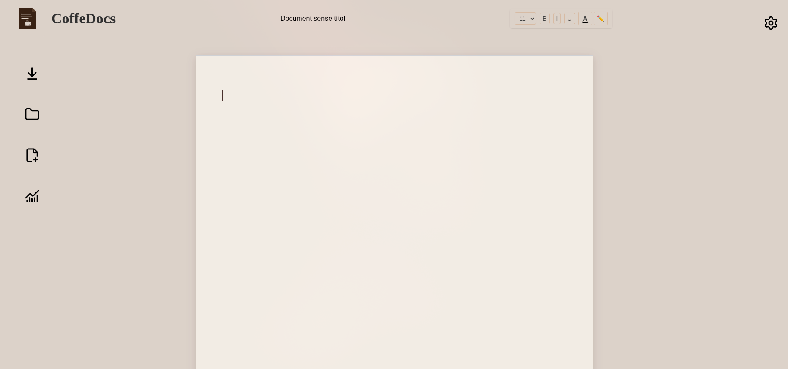

<p align="center">

  

</p>

<p align="center">

  
  
  
  

</p>

---

# ☕ CoffeeDocs

**CoffeeDocs** is a lightweight web-based document editor built from scratch using **HTML, CSS, and vanilla JavaScript**.

The project is inspired by the simplicity of Google Docs, but focuses on a warm coffee-themed interface, a custom editing experience, and local document management.

CoffeeDocs is primarily an **educational project** created to learn how a web-based text editor works internally without relying on frameworks or external libraries.

---

## 📸 Preview

<p align="center">

  

</p>

---

## ✨ Overview

CoffeeDocs is being developed as a hands-on project to understand how different parts of a web application work together.

The project currently explores:

* Semantic HTML structure
* Advanced CSS layouts
* `contenteditable` text editing
* DOM manipulation
* Browser events
* Text selection with `window.getSelection()`
* Text formatting with `document.execCommand()`
* Font-size manipulation
* LocalStorage persistence
* Markdown file import and export
* Document statistics
* Basic file management
* Vanilla JavaScript architecture

The project is intentionally built **without frameworks** so that the underlying browser APIs and application logic remain visible and understandable.

---

## ☕ Design

CoffeeDocs uses a warm, minimal visual style inspired by coffee shops and paper notebooks.

The interface is built around:

* Cream and brown tones
* Soft shadows
* Paper-like surfaces
* Custom SVG icons
* A centered document editor
* Poppins and Inter typography
* A simple and distraction-free editing environment

The goal is to make the editor feel more like a digital sheet of paper than a traditional web application.

---

## 🛠️ Current Features

### Text editor

* Editable document area using `contenteditable`
* Natural text cursor behavior
* Bold formatting
* Italic formatting
* Underline formatting
* Text color selection
* Text highlighting
* Font-size selection

### Document management

* Editable document name
* Automatic document-name persistence using `localStorage`
* Automatic document-content persistence using `localStorage`
* Create a new document
* Import `.md` Markdown files
* Export documents as `.md` files

### Statistics

The editor currently provides:

* Word count
* Character count
* Paragraph count

Statistics are updated from the current editor content.

### Interface

* Coffee-inspired UI
* Custom SVG icons
* Sidebar action buttons
* Statistics panel
* Document toolbar
* Responsive HTML structure

---

## 📁 Project Structure

```text
CoffeeDocs/
│
├── assets/
│   ├── fonts/
│   ├── icons/
│   └── images/
│
├── style/
│   ├── main.css
│   ├── editor.css
│   ├── navbar.css
│   ├── themes.css
│   └── header.css
│
├── js/
│   ├── app.js
│   ├── documentManager.js
│   ├── editor.js
│   ├── storage.js
│   ├── toolbar.js
│   └── ui.js
│
├── html/
│   └── index.html
│
└── README.md
```

The JavaScript is separated by responsibility rather than putting the entire application into one file.

For example:

* `app.js` → statistics and sidebar-related UI logic
* `documentManager.js` → Markdown import/export and new-document actions
* `storage.js` → LocalStorage persistence
* `toolbar.js` → text-formatting functionality
* `editor.js` → editor-related functionality
* `ui.js` → interface-related logic

---

## 🧱 Technologies

| Technology         | Purpose                                         |
| ------------------ | ----------------------------------------------- |
| **HTML5**          | Application structure and editor interface      |
| **CSS3**           | Layout, styling, themes and visual design       |
| **JavaScript**     | Editor logic, DOM manipulation and browser APIs |
| **LocalStorage**   | Persistent document data                        |
| **FileReader API** | Markdown file importing                         |
| **Blob API**       | Markdown file exporting                         |
| **Git**            | Version control                                 |
| **GitHub**         | Repository and project management               |
| **VS Code**        | Development environment                         |

CoffeeDocs currently has **no JavaScript framework and no external runtime dependencies**.

---

## 🧠 What I Am Learning

CoffeeDocs is not only about building an editor. It is also a way to learn how browsers handle editable content.

Some of the main concepts explored in the project are:

### DOM manipulation

Working directly with HTML elements using JavaScript.

### Events

Using events such as:

* `click`
* `input`
* `change`
* `DOMContentLoaded`

### Content editing

The editor is based on:

```html
<div contenteditable="true"></div>
```

This allows the browser to handle text editing directly inside the document.

### Text selection

The formatting system uses:

```javascript
window.getSelection()
```

and `Range` objects to determine what part of the document the user has selected.

### LocalStorage

Document names and editor content are stored locally in the browser so that the document can be restored after reopening the application.

### File APIs

CoffeeDocs uses browser APIs to read and generate Markdown files without requiring a backend server.

---

## 🚧 Roadmap

### Phase 1 — Interface

* [x] Basic project structure
* [x] HTML editor interface
* [x] Header
* [x] Sidebar
* [x] Centered document area
* [x] Coffee-inspired visual design
* [x] Custom icons
* [ ] Complete theme system
* [ ] Dark coffee theme

### Phase 2 — Text Editor

* [x] `contenteditable` editor
* [x] Bold
* [x] Italic
* [x] Underline
* [x] Text color
* [x] Highlight color
* [x] Font-size selector
* [ ] Improve font-size selection behavior
* [ ] Prevent unnecessary nested `<span>` elements
* [ ] Improve selection preservation
* [ ] Keyboard shortcuts

### Phase 3 — Document Management

* [x] Save document content locally
* [x] Save document name locally
* [x] Export Markdown files
* [x] Import Markdown files
* [x] Create a new document
* [ ] Document list
* [ ] Multiple local documents
* [ ] Improved document naming
* [ ] Confirmation before deleting document data

### Phase 4 — Editor Improvements

* [x] Word counter
* [x] Character counter
* [x] Paragraph counter
* [x] Statistics panel
* [ ] Better paragraph handling
* [ ] Improved formatting system
* [ ] Better cursor behavior
* [ ] More formatting options

### Phase 5 — Future Features

* [ ] Markdown preview
* [ ] PDF export
* [ ] Additional themes
* [ ] Custom document settings
* [ ] Improved file management
* [ ] More keyboard shortcuts

---

## 📸 Screenshots

<p align="center">

  

</p>

More screenshots will be added as the interface evolves.

---

## 📝 Development Notes

CoffeeDocs is being developed progressively rather than all at once.

The development process follows:

```text
HTML
  ↓
CSS
  ↓
JavaScript
  ↓
Testing
  ↓
Refactoring
  ↓
New features
```

Building the interface before implementing the JavaScript logic makes it easier to understand what each piece of functionality needs to control.

The project also deliberately avoids frameworks. This makes the code more verbose in some places, but it provides a better understanding of the browser APIs behind the application.

One of the current technical challenges is the font-size system. Applying different font sizes to selections can create nested `<span>` elements, so the selection and DOM manipulation logic is being improved.

---

## 🎯 Project Goal

The main goal of CoffeeDocs is not to compete with professional document editors.

It is a learning project designed to understand how to build a real interactive web application from the ground up.

Through CoffeeDocs, I am learning about:

```text
HTML
  ↓
CSS
  ↓
DOM
  ↓
JavaScript
  ↓
Browser APIs
  ↓
Application State
  ↓
File Management
```

---

## 👨‍💻 Developer

Built as a personal educational project by **Jan Mayolas**.

The project is continuously evolving as I learn more about JavaScript, DOM manipulation, browser APIs, and web application architecture.

---

## 📜 License

CoffeeDocs is an educational project.

You are free to clone, study, modify, and experiment with the project.

---

<p align="center">

  

</p>
